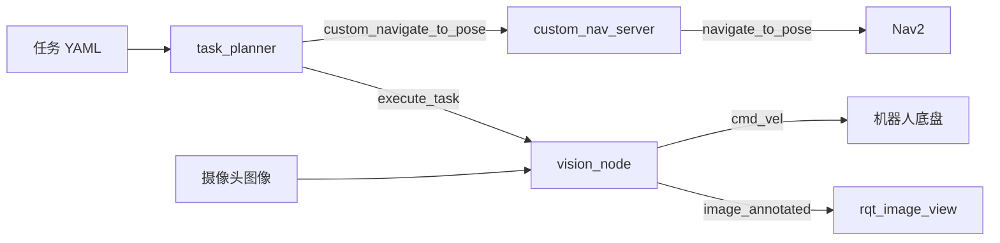

# TurtleBot3 视觉导航任务调度

基于 **ROS 2 Humble、Nav2 和 OpenCV** 的个人机器人项目。通过 YAML 编排任务，让 TurtleBot3 按顺序到达航点、旋转搜索指定颜色目标，并显示检测结果。

本仓库中的任务调度、导航桥接、视觉节点和自定义接口由 **[cwj-66](https://github.com/cwj-66)** 独立开发。TurtleBot3、Nav2、ROS 2 和 OpenCV 为第三方依赖。

## 功能

- **任务编排**：在 YAML 中定义导航与检测任务，成功后执行下一项，失败时停止序列。
- **导航桥接**：将自定义 `NavigateToPose` Action 转发给 Nav2，返回导航成功或失败状态。
- **颜色搜索**：支持红、蓝、绿、黄四种 HSV 颜色阈值；旋转搜索最长 30 秒，检测到目标后停止并保留 3 秒带框画面。
- **并行图像处理**：视觉 Action 和图像订阅使用独立回调组及多线程执行器。
- **生命周期启动**：按视觉节点 → 导航桥接 → 任务规划器的顺序配置、激活节点。

## 架构



| 功能包 | 内容 |
| --- | --- |
| `tb3_custom_nav` | 任务规划、Nav2 桥接、视觉检测、启动文件与示例配置 |
| `tb3_interfaces` | `NavigateToPose.action`、`ExecuteTask.action`、`ObjectPosition.msg` |

```text
src/
├── tb3_custom_nav/
│   ├── tb3_custom_nav/       # Python 节点
│   ├── launch/mission.launch.py
│   └── config/tasks.yaml
└── tb3_interfaces/
    ├── action/
    └── msg/
```

## 环境与构建

目标环境：Ubuntu 22.04、ROS 2 Humble、Python 3.10。先安装并配置 ROS 2 Humble，然后安装依赖：

```bash
sudo apt update
sudo apt install python3-colcon-common-extensions python3-rosdep \
  python3-opencv python3-numpy ros-humble-cv-bridge \
  ros-humble-navigation2 ros-humble-nav2-bringup \
  ros-humble-turtlebot3 ros-humble-turtlebot3-msgs \
  ros-humble-turtlebot3-simulations ros-humble-gazebo-ros-pkgs \
  ros-humble-rqt-image-view
```

在工作空间根目录构建，`src` 是源码目录：

```bash
git clone https://github.com/cwj-66/turtlebot3-vision-navigation.git ~/turtlebot3_ws
cd ~/turtlebot3_ws
source /opt/ros/humble/setup.bash
# 如果尚未初始化 rosdep，先执行一次 sudo rosdep init。
rosdep update
rosdep install --from-paths src --ignore-src -r -y
colcon build --symlink-install --packages-up-to tb3_custom_nav
source install/setup.bash
```

## 运行

每个终端都先加载工作空间，并设置带摄像头的机器人型号：

```bash
source /opt/ros/humble/setup.bash
source ~/turtlebot3_ws/install/setup.bash
export TURTLEBOT3_MODEL=waffle_pi
```

**1. 启动仿真**

```bash
ros2 launch turtlebot3_gazebo turtlebot3_world.launch.py
```

**2. 启动导航并初始化定位**

准备与仿真场景匹配的地图，将下方路径替换为实际地图 YAML 的绝对路径：

```bash
ros2 launch turtlebot3_navigation2 navigation2.launch.py \
  use_sim_time:=true map:=/absolute/path/to/map.yaml
```

在 RViz 中使用 **2D Pose Estimate** 设置机器人初始位姿，确认 Nav2 已就绪。示例航点来自开发场景，需要根据自己的地图修改；本仓库不包含该场景的地图和模型资产。

**3. 启动任务**

```bash
ros2 launch tb3_custom_nav mission.launch.py use_sim_time:=true
```

任务规划器激活后自动开始执行 YAML 中的序列。使用实体机器人时设为 `use_sim_time:=false`，并先启动底盘、摄像头和导航系统。

**4. 查看视觉结果**

```bash
ros2 run rqt_image_view rqt_image_view
```

选择 `/camera/image_annotated`。视觉节点默认订阅 `/camera/image_raw`、发布 `/cmd_vel`；实际设备的话题名不同时，需要调整或重映射。

## 任务配置

修改 [`src/tb3_custom_nav/config/tasks.yaml`](src/tb3_custom_nav/config/tasks.yaml)：

```yaml
task_planner:
  ros__parameters:
    task_sequence: ["go_to_kitchen", "detect_red_box", "go_to_living_room"]
    waypoints:
      go_to_kitchen: [6.5, 2.42, 0.6]
      go_to_living_room: [7.06, 7.36, 0.60]
    speed_limit: 0.2
```

- 导航任务用 `go_to_` 命名，并提供 `[x, y, yaw]`；位置单位为米，朝向单位为弧度，坐标系为 `map`。
- 检测任务可以使用 `detect_red_box`、`detect_blue_box`、`detect_green_box` 或 `detect_yellow_box`。
- HSV 阈值、最小轮廓面积及搜索角速度在 `vision_node.py` 中定义，需要按光照与摄像头调整。
- `speed_limit` 是预留参数，当前没有接入 Nav2；实际速度由 Nav2 和底盘配置控制。

## 当前状态与边界

这是用于展示与进一步开发的机器人原型。开源整理时已检查 Python 语法、包描述和示例配置；当前整理环境为 Windows，**尚未完成 Ubuntu / ROS 2 Humble 下的构建和端到端仿真复测**。

- 检测使用颜色阈值和轮廓面积，不包含目标分类、深度估计或三维定位。
- `ObjectPosition` 消息及 Action 反馈字段为接口预留，当前未发布物体坐标或持续进度反馈。
- 目前没有完整的任务取消、运行中重启和重复生命周期清理支持；建议每轮任务重新启动节点。
- 视觉搜索直接控制底盘，应在 Nav2 导航任务结束后执行。
- 本仓库只发布个人开发的两个功能包，不包含第三方源码副本、生成缓存、个人信息或录制数据。

## 许可证与依赖

本项目代码以 [MIT License](LICENSE) 开源。外部依赖遵循各自的许可证，原创声明限于本仓库发布的自定义功能包。

- [TurtleBot3](https://github.com/ROBOTIS-GIT/turtlebot3)
- [TurtleBot3 Simulations](https://github.com/ROBOTIS-GIT/turtlebot3_simulations)
- [Nav2](https://github.com/ros-navigation/navigation2)
- [OpenCV](https://github.com/opencv/opencv)
